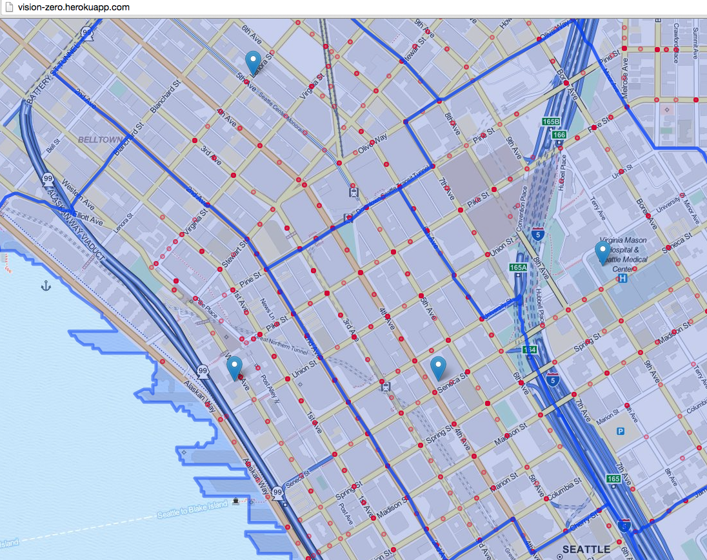

Vision Zero Project
===

[Live Demo](http://vision-zero.herokuapp.com)

###Team Members

* Alex Miranda [@ammiranda](http://github.com/ammiranda)
* Ed Sarausad
* Kate Hotler
* Griffin Howlett [@ghowlett](http://github.com/ghowlett)
* Ronald Ning [@loudest](http://github.com/loudest)
* Dorene Cornwell
* Paul Wirsing [@pwirsing](http://github.com/pwirsing)
* Matthew Adkins
* Peter Shaw
* Kenneth Trease
* Dongho Chang
* Sheree Wen [@swen686](http://github.com/swen686)
* Jim Walseth [@jwalseth](http://github.com/jwalseth)
* Dorene Cornwell

###Goal: Improve overall understanding of the region’s transportation needs

### Shared work folder [Vision Zero Safe Street Score](https://drive.google.com/folderview?id=0BxiLoXQcmiZLflVYamhvS2h6MkZfM1ZOVFl0WDRHejdUamRRUGNybGhwMU91dkdmYmp5VzA&usp=sharing)

## Technologies, APIs, and Datasets Utilized

We made use of:
- [Python - Flask]
- [JavaScript]
- [GIS GeoJSON]

Our code is licensed under the [MIT License](LICENSE.md).
